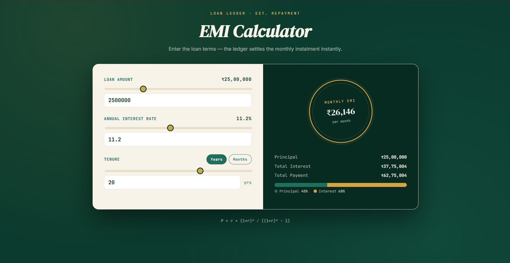

# EMI Calculator

A loan EMI (Equated Monthly Instalment) calculator that computes monthly instalments, total interest, and total payment using the standard amortization formula. Includes interactive sliders and a principal-vs-interest breakdown bar.

## Features
- Input loan amount, annual interest rate, and tenure (years/months toggle)
- Slider + text input, kept in sync
- Real-time EMI calculation as values change
- Displays Principal, Total Interest, and Total Payment
- Visual breakdown bar showing principal vs. interest split (%)

## Formula Used
EMI = P × r × (1+r)^n / ((1+r)^n − 1)

Where:
- P = Principal loan amount
- r = Monthly interest rate
- n = Number of monthly instalments

## Tech Stack
- HTML5
- CSS3
- Vanilla JavaScript (real-time calculation, slider sync)

## How to Run
1. Clone the repo
2. Open `index.html` in any browser
   or
3. View the live demo: [Live Demo](https://diksha-wadekar.github.io/emi-calculator/)

## Screenshot

